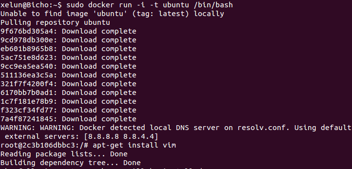
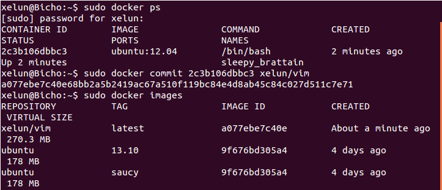
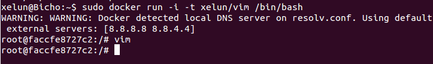

#Tema 1 - Ejercicio04
- - -
### **Hacer el tutorial de línea de órdenes de docker para comprender cómo funciona.**

Primero añadimos las llaves y el repositorio de Docker usando los comandos:

> \# sh -c "curl https://get.docker.io/gpg | apt-key add - 
> \# sh -c "echo deb https://get.docker.io/ubuntu docker main > /etc/apt/sources.list.d/docker.list.

Tras esto actualizamos el sistema:

> \# apt-get update

E instalamos Docker con el comadno:

> \# apt-get install lxc-docker

Para trabajar con Docker primero debemos introducirnos en su terminal. Para ello usamos el comando:

> \# docker run -i -t ubuntu /bin/bash

Una vez termina ya podemos crear nuestra aplicación contenedorizada. En nuestro caso, la aplicación será el editor de textos *vim*. Para ello, dentro de la terminal de docker ejecutamos el comando:

> \# apt-get install vim

Desde una terminal en nuestra máquina ejecutamos el comando para ver el identificador del contenedor en el que hemos instalado *vim:

> \# docker ps

Ahora creamos una imagen de dicho contenedor para poder usarlo directamente con el comando:

> \# docker commit ID USUARIO/APLICACION

Podemos ver que la imagen se ha creado correctamente con el comando:

> \# docker images

Ahora podemos ejecutar directamente la imagen que acabamos de crear con:

> \# docker run -i -t xelun/nano /bin/bash

Así podremos usar directamente cuando queramos la imagen con el programa *vim* que acabamos de crear:

