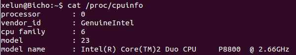
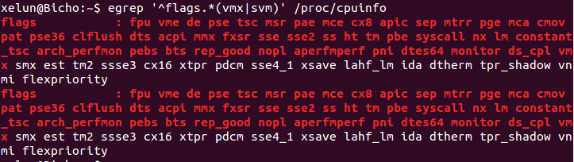

#Tema 1 - Ejercicio09
- - -
### **Comprobar si el procesador o procesadores instalados lo tienen. ¿Qué modelo de procesador es? ¿Qué aparece como salida de esa orden?**

Podemos saber el nombre de nuestro procesador con el comando:

> $ cat /proc/cpuinfo

Como podemos ver como resultado de la salida del siguiente comando:

> $ egrep '^flags.*(vmx|svm)' /proc/cpuinfo

El flag "vmx" se encuentra entre todos los flag del procesador, por lo que sabemos que el procesador usa tecnología de virtualización a nivel de hardware.

