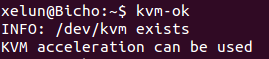

#Tema 1 - Ejercicio10
- - -
### **Comprobar si el núcleo instalado en tu ordenador contiene este módulo del kernel usando la orden *kvm-ok*.**

Podemos comprobar que contiene el módulo con el comando:

> $ kvm-ok

