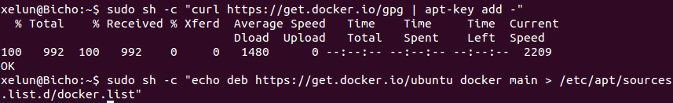
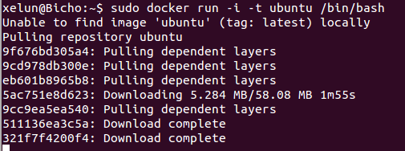

#Tema 3 - Ejercicio10
- - -
### **Instalar Docker**

Primero añadimos las llaves y el repositorio de Docker usando los comandos:

> \# sh -c "curl https://get.docker.io/gpg | apt-key add - 
> \# sh -c "echo deb https://get.docker.io/ubuntu docker main > /etc/apt/sources.list.d/docker.list.

Tras esto actualizamos el sistema:

> \# apt-get update

E instalamos Docker con el comadno:

> \# apt-get install lxc-docker

Para trabajar con Docker primero debemos introducirnos en su terminal. Para ello usamos el comando:

> \# docker run -i -t ubuntu /bin/bash

Para salir de esta terminal tan solo hace falta escribir:

> $ exit

