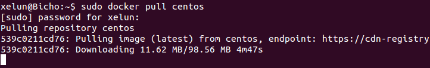

#Tema 3 - Ejercicio11
- - -
###**Instalar a partir de docker una imagen alternativa de Ubuntu y alguna adicional, por ejemplo de CentOS.**

Para instalar una imagen con Docker debemos ejecutar el comando:

> \# docker pull <nombre_imagen>

Donde <nombre_imagen> es el nombre de la imagen mantenida por el propio equipo de Dockerfile.

***Ejemplo:***

Si quieres instalar ubuntu 12.04 usarás el nombre *dockerfile/ubuntu*:

> \# docker pull dockerfile/ubuntu

Si quieres instalar centos usarás el nombre *centos*:

> \# docker pull centos

###b) **Buscar e instalar una imagen que incluya MongoDB.**

Si quieres instalar una imagen que incluya *MongoDB*:

> \# docker pull jonhadfield/mongodb
