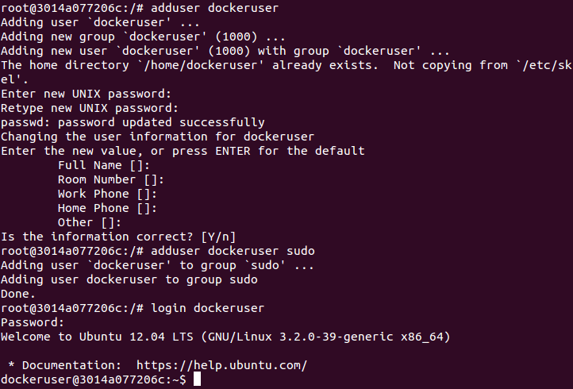

#Tema 3 - Ejercicio12
- - -
###**Crear un usuario propio e instalar nginx en el contenedor creado de esta forma.**

Primero iniciamos la terminal de *Docker* con el comando:

> \# docker run -i -t ubuntu /bin/bash

Después creamos el usuario con poderes de root dentro y nos logueamos con él. Para esto usamos los comandos:

> \# adduser dockeruser sudo
> \# login dockeruser

Para instalar nginx primero hay que añadir su repositorio, como es un repositorio PPA, primero hay que instalar los siguientes paquetes:

> \# apt-get install software-properties-common
> \# apt-get install python-software-properties
> \# apt-get update

Y ahora ya podemos añadir el repositorio de nginx.

> \# add-apt-repository ppa:nginx/stable
> \# apt-get update

E instalamos nginx por último:

> \# apt-get install nginx
