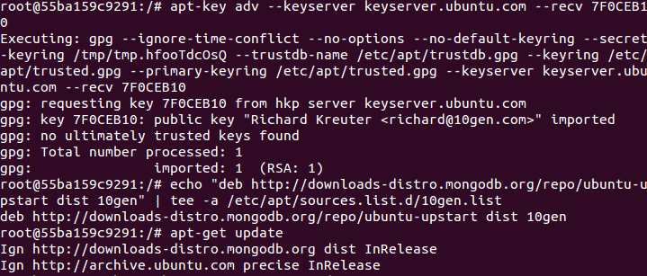

#Tema 3 - Ejercicio14
- - -
###**Crear una imagen con las herramientas necesarias para DAI sobre un sistema operativo de tu elección.**

Primero creamos una imagen persistente igual que en el ejercicio anterior llamada docker-dai.

En ella habremos ejecutado los siguientes comandos:

> \# apt-key adv --keyserver keyserver.ubuntu.com --recv 7F0CEB10
> \# echo "deb http://downloads-distro.mongodb.org/repo/ubuntu-upstart dist 10gen" | tee -a /etc/apt/sources.list.d/10gen.list
> \# apt-get update
> \# apt-get -y install python python-setuptools mongodb-10gen python-django gcc build-essential python-dev
> \# easy_install web.py
> \# easy_install mako
> \# easy_install pymongo
> \# easy_install feedparser
> \# easy_install tweepy

Con esto ya tendremos todos los programas necesarios para ejecutar nuestra aplicación de DAI con los paquetes:

* python
* mongodb
* easy-install
* django
* web.py
* mako
* pymongo
* feedparser
* tweepy

