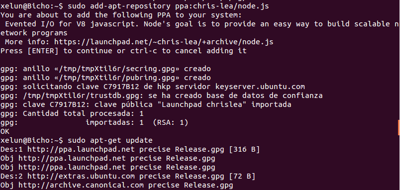
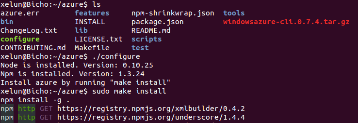
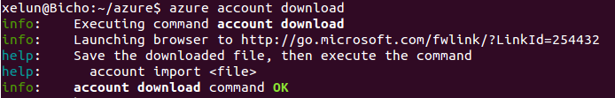
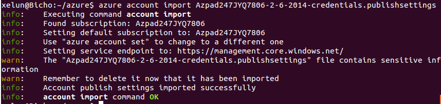
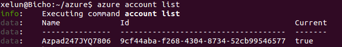
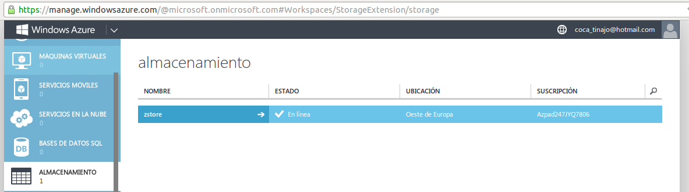

#Tema 4 - Ejercicio08
- - -

###**Tras crear la cuenta de Azure, instalar las herramientas de línea de órdenes (Command line interface, cli) del mismo y configurarlas con la cuenta Azure correspondiente.**

Una vez registrados primero instalamos nodejs de su repositorio con los comandos:

> \# add-apt-repository ppa:chris-lea/node.js
> \# apt-get update
> \# apt-get install nodejs

Ahora instalamos el cliente de windows. La instalación del programa npm y su uso me daba fallos, así que descargue el [fichero fuente](http://az412849.vo.msecnd.net/downloads02/windowsazure-cli.0.7.4.tar.gz) y lo descomprimi directamente:

> $ mkdir azure
> $ cd azure
> $ wget http://az412849.vo.msecnd.net/downloads02/windowsazure-cli.0.7.4.tar.gz
> $ tar -xzf windowsazure-cli.0.7.4.tar.gz

Tras esto instalamos azure:

> $ ./configure
> \# make install

Ahora descargamos la configuración de nuestra cuenta con el comando:

> $ azure account download

Abrimos el enlace que nos da y guardamos el fichero que nos descarga, importandolo a azure:

> $ azure account import fichero.publishsettings

Ahora ya podemos (más bien debemos) borrar este fichero y podemos mirar nuestra nueva cuenta con el comando:

> $ azure account list

El siguiente paso es crear nuestra cuenta de almacenamiento:

> $ azure account storage create zstore

Y ahora exportamos los valores obtenidos a las variables de entorno que les corresponde:

> $ export AZURE_STORAGE_ACCOUNT=zstore
> $ export AZURE_STORAGE_ACCESS_KEY=bLz8TtE******************==

De esta forma ya tendremos todo configurado para usar azure:

> **Nota:**
> He usado la misma cuenta de *Azure* que mi compañero Iñaki Fernández, por lo que el crear la cuenta de almacenamiento dió fallo ya que la versión de prueba de azure solo permite tener una y no se podía eliminar.
