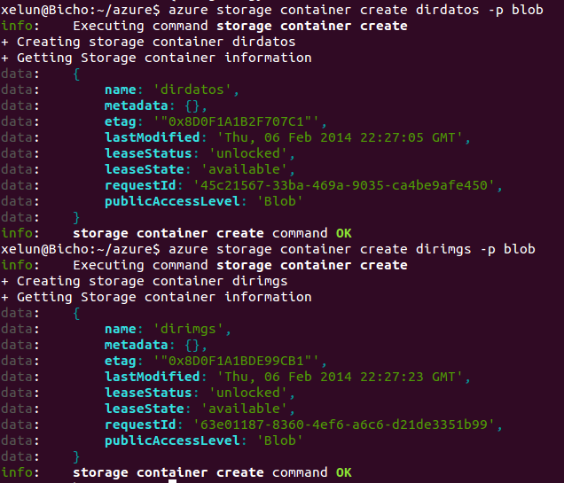
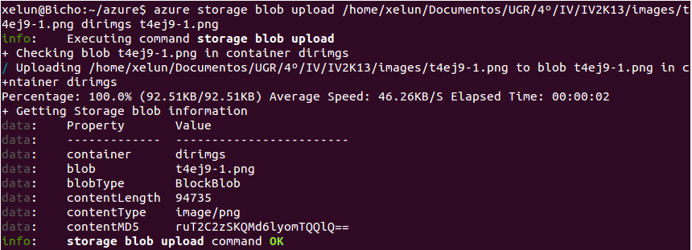

#Tema 4 - Ejercicio09
- - -

###**Crear varios contenedores en la cuenta usando la línea de órdenes para ficheros de diferente tipo y almacenar en ellos las imágenes en las que capturéis las pantallas donde se muestre lo que habéis hecho.**

Primero crearemos dos carpetas, una contendrá todos los ficheros de datos y otra las imágenes que realicemos. Para hacer esto ejecutamos los comandos:

> $ azure storage container create dirdatos -p blob
> $ azure storage container create dirimgs -p blob

Ahora subiremos la imagen que tenemos justo arriba a nuestro directorio de imagenes. Para esto ejecutamos el comando:

> $ azure storage blob upload /home/xelun/Documentos/UGR/4º/IV/IV2K13/images/t4ej9-1.png dirimgs t4ej9-1.png

La imagen la podremos ver desde [aquí](http://zstore.blob.core.windows.net/dirimgs/t4ej9-1.png).

La dirección de la segunda imagen es [esta](http://zstore.blob.core.windows.net/dirimgs/t4ej9-2.png).
