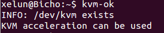

#Tema 5 - Ejercicio01
- - -
### **Instalar los paquetes necesarios para usar KVM.**

Primero instalamos los paquetes necesarios:

> \# apt-get install qemu-kvm libvirt-bin
> \# modprobe kvm-intel

Después podemos comprobar si nuestro sistema soporta KVm con el comando:

> $ kvm-ok

