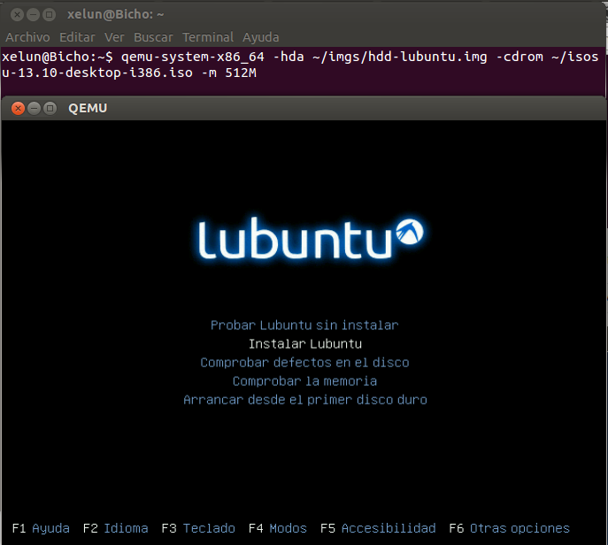
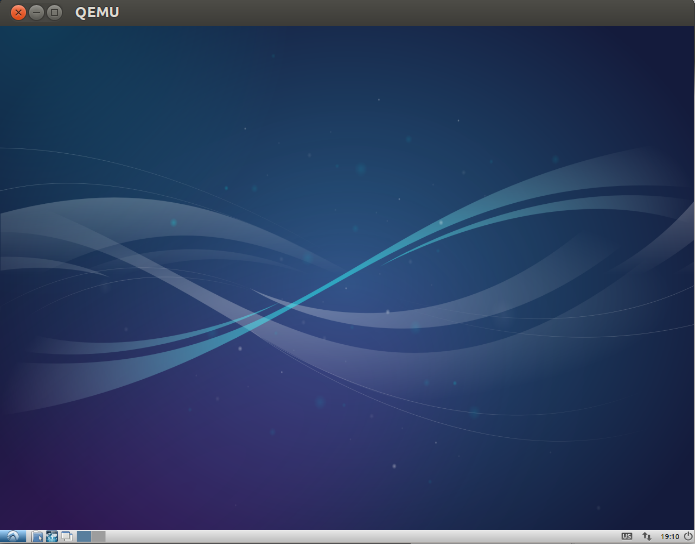

#Tema 5 - Ejercicio04
- - -
### **Crear una máquina virtual Linux con 512 megas de RAM y entorno gráfico LXDE a la que se pueda acceder mediante VNC y ssh.**

Para este ejercicio instalaremos Lubuntu, ya que usa pocos recursos, lo que viene bien con 512MB de RAM y, además, usa el entorno LXDE pedido. Para ello primero deberemos descargarlo con el siguiente comando:

> $ wget http://cdimage.ubuntu.com/lubuntu/releases/13.10/release/lubuntu-13.10-desktop-i386.iso

Ahora creamos el archivo que hace de disco duro virtual y arrancamos la máquina virtual indicando este archivo:

> $ qemu-img create -f qcow2 hdd-lubuntu.img 15G
> $ qemu-system-x86_64 -hda ~/imgs/hdd-lubuntu.img -cdrom ~/isos/lubuntu-13.10-desktop-i386.iso -m 512M

*Con el parámetro -m indicamos la cantidad de RAM que le permitiremos tener como máximo a nuestra máquina virtual.*

Ahora podemos ejecutar la máquina normalmente con el comando:

> $ qemu-system-x86_64 -boot order=c -drive file=~/imgs/hdd-lubuntu.img,if=virtio -m 512M

