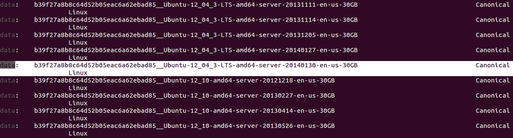
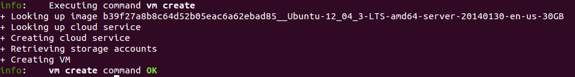
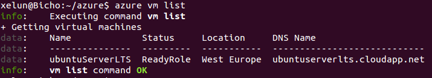
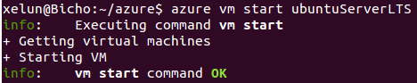
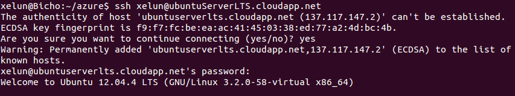
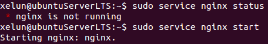
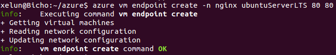
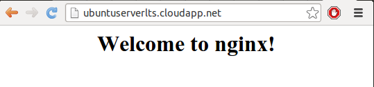

#Tema 5 - Ejercicio05
- - -
### **Crear una máquina virtual ubuntu e instalar en ella un servidor nginx para poder acceder mediante web.**

Para crear una máquina virtual en nuestra cuenta de azure primero debemos ver las imagenes que nos ofrece la plataforma. Podemos ver una lista de ellas con el comando:

> $ azure vm image list

Como tiene que ser un SO de ubuntu, buscaremos el que tenga Ubuntu Server con la versión LTS más actual (en este caso, la 12-04):

Ahora creamos la máquina con el comando:

> $ azure vm create ubuntuServerLTS b39f27a8b8c64d52b05eac6a62ebad85__Ubuntu-13_10-amd64-server-20131215-en-us-30GB xelun <password> --location "West Europe" --ssh

Tras esto ya podemos comprobar si se ha creado nuestra máquina virtual con el comando:

> $ azure vm list

La podemos iniciar con el comando:

> $ azure vm start ubuntuServerLTS

Una vez iniciada la máquina podemos comprobar que podemos hacer una conexión ssh:

> $ ssh xelun@ubuntuServerLTS.cloudapp.net

Una vez dentro de la máquina virtual por ssh procedemos a instalar *Nginx*:

> $ sudo apt-get install nginx

Comprobamos si Nginx se ha iniciado y, en caso contrario, lo inicializamos:

> $ sudo service nginx status
> $ sudo service nginx start

Ahora volvemos a nuestra máquina y procedemos a abrir los puertos para que la página de nginx sea vista desde fuera:

> $  azure vm endpoint create -n nginx ubuntuServerLTS 80 80

Con esto ya podemos acceder a nuestra página desde la dirección:
 > http://ubuntuserverlts.cloudapp.net/

