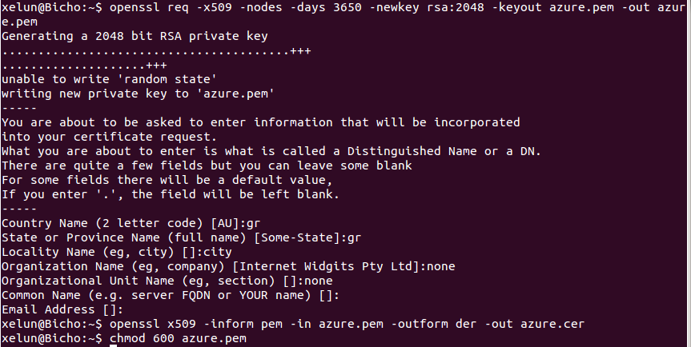
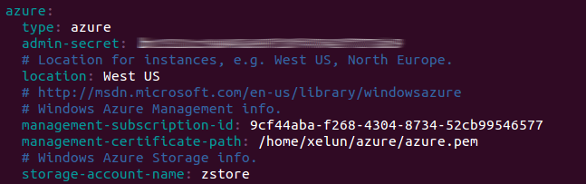
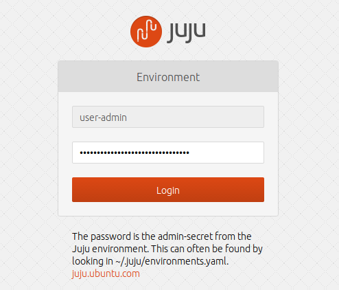

#Tema 5 - Ejercicio06
- - -
### **Usar juju para hacer el ejercicio anterior.**

Para hacer este ejercicio seguiremos [este](https://juju.ubuntu.com/docs/config-azure.html) tutorial.

Si no tenemos instalado juju en nuestro sistema lo hacemos con los comandos:

> \# apt-get install juju-core
> $ juju init

A continuación creamos el certificado ssl para usar juju:

> $ openssl req -x509 -nodes -days 3650 -newkey rsa:2048 -keyout azure.pem -out azure.pem
> $ openssl x509 -inform pem -in azure.pem -outform der -out azure.cer
> $ chmod 600 azure.pem

Ahora debemos modificar el archivo *~/.juju/environments.yaml* con los siguientes parámetros:

- management-susbscription-id: usaremos el comando *"azure account list"* para sacar este Id.
- management-certificate-path: ruta del fichero "azure.pem" que acabamos de crear.
- storage-account-name: usaremos el comando *"azure storage account list"* para sacar el nombre de nuestro contenedor.
- location: West Europe

También cambiamos la linea *default: local* por *default: azure*.

Entramos en la web de azure con nuestras credenciales y vamos al apartado de *Configuración* (menú lateral izquierdo, abajo del todo). Dentro hacemos click en *Certificados de administración* y a *Cargar*. Subimos el fichero *"azure.cer"* que se nos ha creado antes.

Ahora creamos un taper tal y como hicimos en ejercicios anteriores:

> \# juju switch azure
> \# sudo juju bootstrap
> \# sudo juju deploy --to 0 juju-gui
> \# sudo juju expose juju-gui

Tras esto ya podemos entrar en la página desde la public address que nos muestra al realizar el comando *\# juju status*:

*Para acceder usaremos de nombre de usuario *user-admin* y, como contraseña, el valor que hay en el campo *admin-secret* en el archivo *~/.juju/environments.yaml*.
