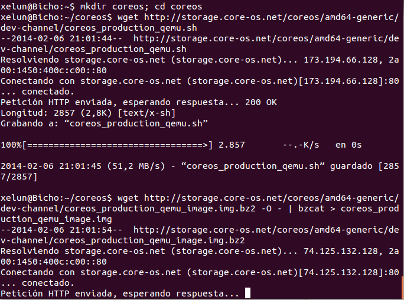
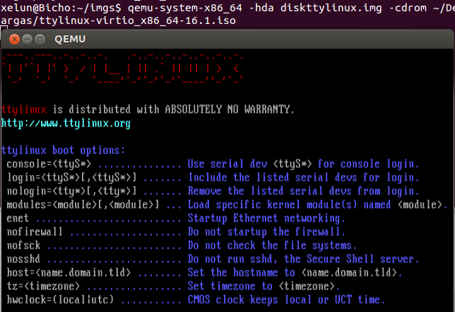
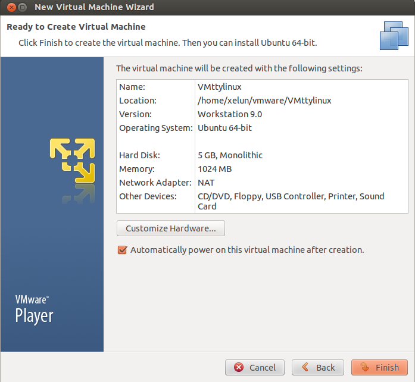
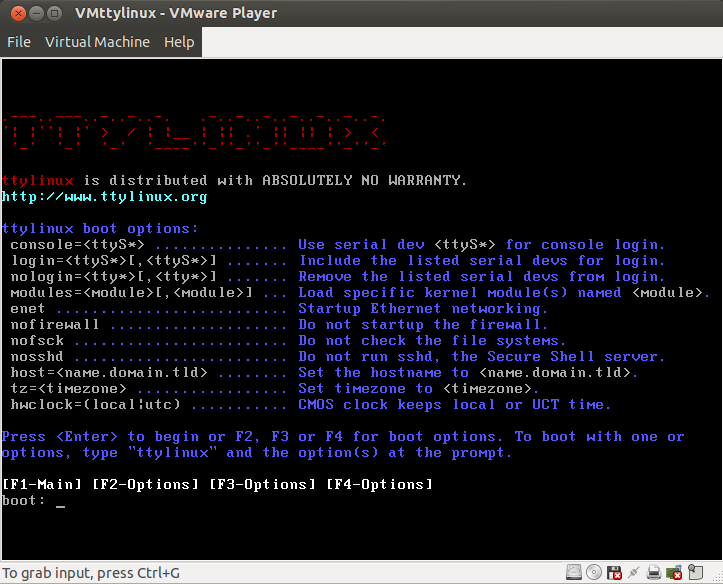

#Tema 5 - Ejercicio02
- - -
### a) **Crear varias máquinas virtuales con algún sistema operativo libre, Linux o BSD. Si se quieren distribuciones que ocupen poco espacio con el objetivo principalmente de hacer pruebas se puede usar CoreOS, GALPon Minino, Damn Small Linux, SliTaz o ttylinux.**

Para comenzar usaremos el SO de CoreOS. Para ello podemos seguir el [siguiente](https://coreos.com/docs/running-coreos/platforms/qemu/) tutorial de la página oficial donde nos indican como hacer que funcione su sistema en KVM. Para ello primero se ejecutan los siguientes comandos:

> $ mkdir coreos; cd coreos
> $ wget http://storage.core-os.net/coreos/amd64-generic/dev-channel/coreos_production_qemu.sh
> $ wget http://storage.core-os.net/coreos/amd64-generic/dev-channel/coreos_production_qemu_image.img.bz2 -O - | bzcat > coreos_production_qemu_image.img
> $ chmod +x coreos_production_qemu.sh

Tras esto solo queda ejecutar la máquina con el comando:

> $ ./coreos_production_qemu.sh -nographic

El siguiente sistema que usaremos será ttylinux, para ello primero descargamos su iso. Para ello utilizamos el comando para descargarlo y despues lo descomprimimos:

> $ wget http://ttylinux.net/Download/ttylinux-virtio_x86_64-16.1.iso.gz
> $ gunzip ttylinux-virtio_x86_64-16.1.iso.gz

Después creamos el fichero de almacenamiento virtual:

> $ qemu-img create -f raw diskttylinux.img 256M

Ahora iniciamos la máquina especificándole la imagen de ttylinux que hemos descargado antes y el disco que hemos creado en el paso anterior:

> $ qemu-system-x86_64 -hda diskttylinux.img -cdrom ~/isos/ttylinux-virtio_x86_64-16.1.iso

### b) **Hacer un ejercicio equivalente usando otro hipervisor como Xen, VirtualBox o Parallels.**

Para este apartado usaremos VMware. Hipervisor muy parecido a VirtualBox pero de código libre. Para ello usaremos la iso del SO ttylinux que teníamos del ejercicio anterior y creamos una nueva máquina virtual desde el entorno gráfico que nos porporciona VMware:

Tras esto ya tendremos la máquina iniciada con nuestro SO:

