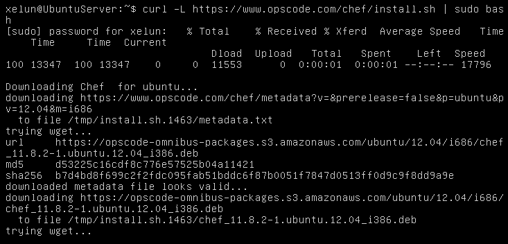

#Tema 6 - Ejercicio01
- - -
### **Instalar chef en la máquina virtual que vayamos a usar.**

Para instalar chef en la máquina virtual que queramos, la inicializamos y ejecutamos en ella el comando:

> $ curl -L https://www.opscode.com/chef/install.sh | sudo bash

