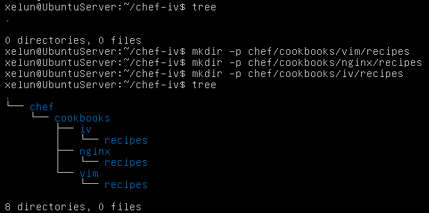
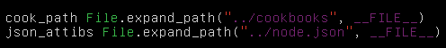
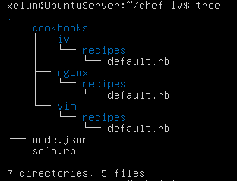

#Tema 6 - Ejercicio02
- - -
### **Crear una receta para instalar nginx, tu editor favorito y algún directorio y fichero que uses de forma habitual.**

Para este ejercicio vamos a crear una receta para instalar *nginx*. Como editor instalaremos *Vim* y, como directorio, crearemos uno llamado **IV** para almacenar los datos de esta asignatura.

Primero creamos el directorio donde irá nuestra receta:

> $ mkdir -p chef/cookbooks/vim/recipes chef/cookbooks/nginx/recipes chef/cookbooks/iv/recipes

Si nuestra máquina vistual no lo tiene, deberemos instalar el programa tree con el comando:

> \# apt-get install tree

Tras estos pasos el árbol de directorios lo tendremos de la siguiente forma:

Creamos nuestro archivo node.json con los atributos de cada una de las recetas que tendremos y como ejecutarlas. El fichero quedará algo parecido a la imagen siguiente:

Creamos el fichero solo.rb con el siguiente contenido:

Ahora debemos crear un archivo default.rb dentro de la carpeta recipes de cada una de las recetas que vayamos a crear. En este archivo estaŕan los pasos a seguir.

Para instalar los paquetes de **Vim** y **nginx** los ficheros tendrán que tener el siguiente contenido respectivamente:

> package 'vim'

> package 'nginx'

Para crear un directorio con un fichero dentro, tendremos que tener el siguiente contenido dentro de default.rb:

> **directory '/home/xelun/IV'**

> file "/home/xelun/IV/prueba.txt" do*
>	: owner "xelun"
>	 group "xelun"
>	 mode 00544
>	 action :create
>	 content "Directorio para documentos de la asignatura IV"

> **end**

Tras estos pasos nos quedará el siguiente árbol de directorios:

Con esto ya podremos ejecutar las recetas con el comando:

> \# chef-solo -c chef-iv/solo.rb -j chef-iv/node.json
