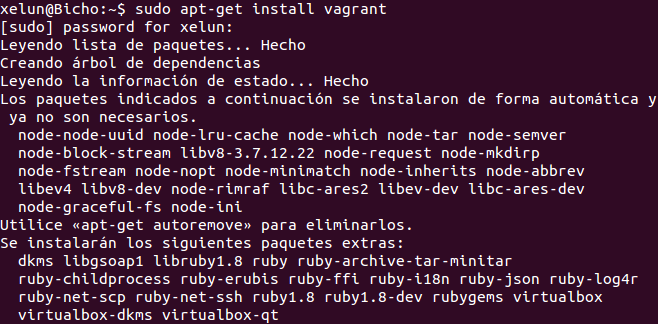
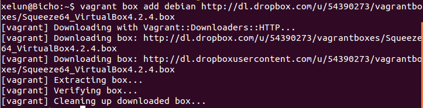
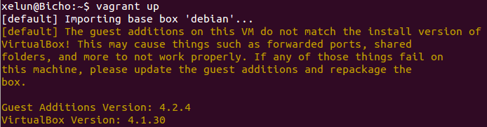
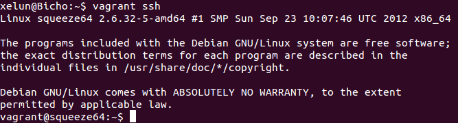

#Tema 6 - Ejercicio06
- - -
### **Instalar una máquina virtual Debian usando Vagrant y conectar con ella.**

*Antes de instalar vagrant tenemos que tener instalado VirtualBox en su versión 4.0 o 4,1*

Antes de crear una máquina virtual con Vagrant debemos instalarlo con el comando:

> \# apt-get install vagrant

Ahora miramos en la [página de Vagrant](www.vagrantbox.es) una máquina Debian y la descargamos e inicializamos:

> $ vagrant box add debian https://dl.dropboxusercontent.com/u/197673519/debian-7.2.0.box

"Inicializamos" la máquina (creación de fichero de configuración en el directorio actual):

> $ vagrant init debian

Iniciamos la máquina con el comando:

> $ vagrant up

Ya nos podemos conectar a ella con:

> $ vagrant ssh

