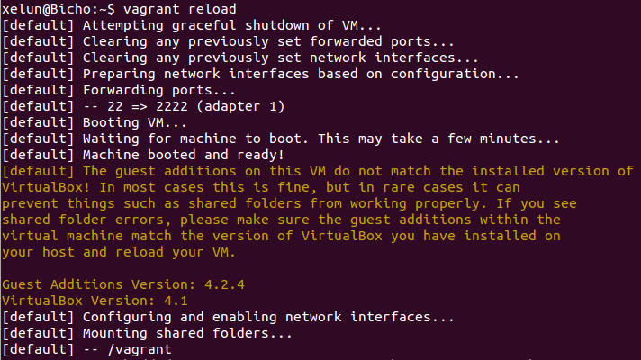
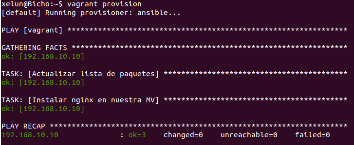
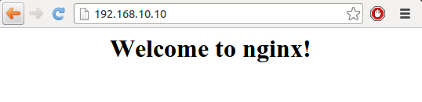

#Tema 6 - Ejercicio08
- - -
### **Configurar tu máquina virtual usando vagrant con el provisionador ansible.**

Para configurar nuestra máquina con *ansible* primero tenemos que asignarle una dirección IP para poder indicarle a *ansible* a que máquina debe conectarse para configurarla.

Para indicarle una IP editamos de nuevo el fichero *Vagrantfile* añadiendole la siguiente línea:

```
config.vm.network :private_network, ip: "192.168.10.10"
```

*La IP puede ser cualquiera accesible desde nuestra máquina local*

Ahora recargamos la máquina para que se actualicen los cambios:

> $ vagrant reload



Volvemos a editar el fichero *Vagrantfile* para que quede parecido a esto:

```
Vagrant::Config.run do |config| 
  config.vm.box = "debianVM" 
  config.vm.network "private_network", ip: "192.168.10.10"

  config.vm.provision "ansible" do |ansible| 
    ansible.playbook = "playbook.yml" 
    ansible.inventory_path = "hosts"
  end
end
```
En nuestro fichero *host.yml* de *ansible* añadimos las siguientes líneas:

```
[vagrant]
192.168.10.10
```

Ahora debemos crear un playbook para que lo lea *ansible*:

```
- hosts: vagrant 
  sudo: yes 
  tasks: 
    - name: Actualizar lista de paquetes
      apt: update_cache=yes
    - name: Instalar nginx en nuestra MV
      apt: name=nginx state=latest 
      
  handlers: 
    - name: restart nginx 
      service: name=nginx state=restarted 
```

Ahora ejecutamos el siguiente comando para cargar el provisionamiento:

> $ vagrant provision



Ya podemos comprobar que funciona correctamente accediendo desde la IP que le dimos en un principio:


